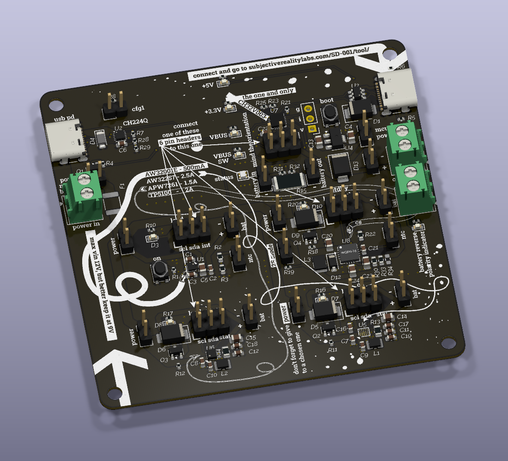

# SD-001

## A devboard to test and demostrate principle of using 4 different lithium-ion battery charging ICSs

This board studies the use of these 4 charge ICs: AW32001 and AW32257 from Awinic, APW7261 from Anpec and TP5100 from Top Power Asic.

### AW32001

The smallest of the four and the only one of them that is a linear and doesn't require extra components like inductor, shunt resistor, or diode. It has maximum charge current of 500mA and is ideal for small devices with small batteries. It has I2C interface that allows changing various setting like charging current, charge voltage, end charge voltage, etc. It also has internal load switch and can switch load off via I2C command, but then requires an external input to exit sleep mode (shipping mode in their term).

### AW32257

This is the older sibling of the previous one. It is a buck-converted 2.5A charge IC (there is AW32207 version that is identical in every aspect but is 2A max) that also has I2C interface and even can work in OTG mode, where it boosts battery voltage up to 5V and sends it back to VIN. It is more expensive, has bigger package size and need additional inductor and suitable shunt resistor.

### APW7261

At the moment of writing, this is the cheapest charging IC of these 4, going as low as 2c per piece. It is mostly unexpected and unexplained because in many aspects it is the very close copy of AW32207/AW32257 (but I think this is other way around because APW7261 is much older chip). There are some minor differences in the pins and layout (it uses 2 pins that are unused in AW32257) and I2C registers. Also it is limited to 1.5A charging current.

### TP5100

Very different chip from the ones described above. It uses unsynchronised buck topology and requires an external schottky diode. It also comes in much bigger package and lacks I2C functionality, every setting is done via external resistor combination. The interesting feature of this chip, though, is its ability to charge 2S batteries up to 8.4V (with enough input voltage provided). The 4.2V/8.4V target voltage is selected via one of its pins. It also has a sibling chip TP5000 with almost identical layout (*almost* is the most annoying part, it's not fully pin compatible, and thus you can't do a drop-in replacement with it in your designs) but with only 4.2V target voltage option. The max charging current this chip provides is 2A.

## How to use this board

The board is divided in 6 sections:

- Power input for battery charges
- 4 separate blocks, one for each charger IC
- control block that uses CH32V003 for controlling connected charger IC via USB interface and a has screw terminals for battery and output load.

### Power input

There is a screw terminals for power input up to 12V. Also there is a USB type-C connector with CH224Q chip that provides USB-PD support to ask for 9V from the compatible power supply, to be support 2S charging on TP5100. CH224Q is connected to the MCU via I2C and can be configured with it. The power input line is protected with a 3A polyfuse and a 10V TVR diode as suggested in Awinic's datasheets. Then power is distributed to each charger block and can be connected/disconnected using a 2.54mm jumper. There is a MOSFET that allows switching this power from the MCU and can be bypassed with a jumper.

### Charger blocks

Each block has input power jumper, a 6-pin header to connect to the MCU a 2-pin header fo battery connection and 2-pin header for NTC termistor for ICs that support it. Each block has a P-channel MOSFET and a diode to allow simple load switch from battery power to external power when it is provided.

### MCU block

On-board CH32V003 uses I2C bus to control ICs that support it and then provide interface to a use via USB connection. It also uses built-in ADC and the comparator to control input and battery voltages and battery current. There is an addressable RGB LED that is used to show operation status. Battery connection is protected from accidental polarity reversal with a P-channel MOSFET, an LED will be lit in such case.

In order to use MCU functionality of the board you need to connect a 6-pin header of one of 4 charger blocks to a 6-pin header of the MCU block with included ribbon cable. And connect battery header of the charger block to a battery input header of the MCU block, this will allow battery monitoring via the user interface.
